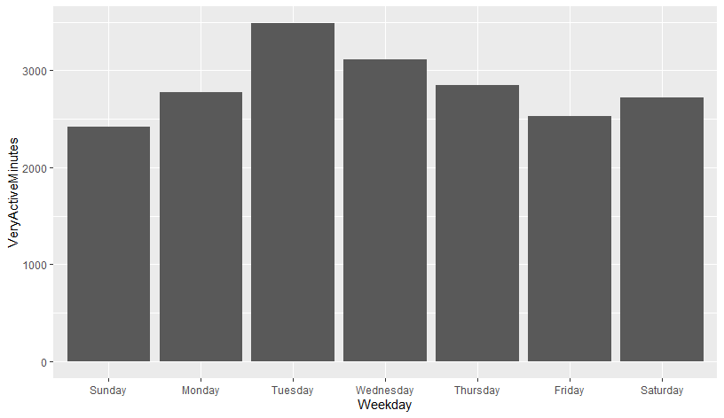

# Summary of Analysis

- To find the relation between activity and weekdays, the following commands were used

```
# Weekday vs. TotalDistance
level_order <- c("Sunday","Monday","Tuesday","Wednesday","Thursday","Friday","Saturday")
ggplot(Activity, mapping = aes(x = factor(weekday, level = level_order), y = TotalDistance))+
  geom_bar(stat = "identity")+
  xlab("Weekday")
  
```


```
# Weekday vs. VeryAciveMinutes
level_order <- c("Sunday","Monday","Tuesday","Wednesday","Thursday","Friday","Saturday")
ggplot(Activity, mapping = aes(x = factor(weekday, level = level_order), y = VeryActiveMinutes))+
  geom_bar(stat = "identity")+
  xlab("Weekday")
  
```



```
# Weekday vs. TotalSteps
level_order <- c("Sunday","Monday","Tuesday","Wednesday","Thursday","Friday","Saturday")
ggplot(Activity, mapping = aes(x = factor(weekday, level = level_order), y = TotalSteps))+
  geom_bar(stat = "identity")+
  xlab("Weekday")
  
```


```
# Weekday vs. SedantaryMinutes
level_order <- c("Sunday","Monday","Tuesday","Wednesday","Thursday","Friday","Saturday")
ggplot(Activity, mapping = aes(x = factor(weekday, level = level_order), y = SedantaryMinutes))+
  geom_bar(stat = "identity")+
  xlab("Weekday")
  
```


## Trends of Each Participant
```
ggplot(Activity, mapping = aes(x = days_from_start, y = TotalDistance, group= 1))+
  geom_point()+
  geom_smooth()+
  facet_wrap(~Id)
```

